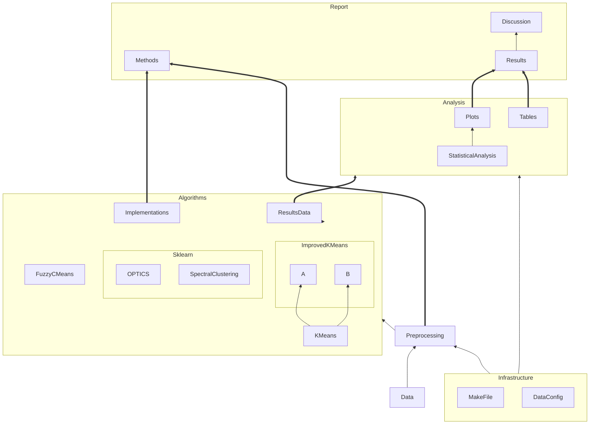

# 2024-11-19 Notes

## KMeans

* various distance metrics could be used
* we should use an iteration limit, in addition to convergence with tolerance
  * there could be a datapoint which keeps switching between clusters
* how to initialize centroids for k-means?
  * random initialization
  * could repeat multiple (m) times and take the best result?
* noisy data points can shift the centroids significantly
  * can filter noisy points
  * can use median instead of mean to better handle outliers
  * could use k-medoids (use medoid instead of mean)
  * this year we don't do any of these alternatives to centroids
* binary data can be considered as categorical or numerical

### Variations of KMeans

* Choosing better initial centroids
  * k-means++
  * intelligent k-means
  * genetic k-means
* Choosing different representatives for the clusters
  * k-medoids, k-medians, k-modes

### Fuzzy C-Means
* only one fuzzy algorithm

## Questions
* should we use multiple distance metrics?
* how do we handle mixed categorical and numerical data?
* should we use feature selection?
* do we need to get approval for the third dataset?
* we are going to change from mushroom dataset since it uses only categorical data

## Work flow
